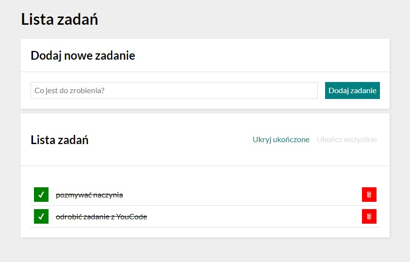

# Do zrobienia

  

> This project is a simple to-do list made with Javascript.

  

> Live demo [_here_](https://dickjaeger.github.io/to-do-list/).

  

## Table of Contents

  

* [General Info](#general-information)

  

* [Technologies Used](#technologies-used)

  

* [Features](#features)

  

* [Screenshots](#screenshots)

  

* [Project Status](#project-status)

  

* [Acknowledgements](#acknowledgements)

  

* [Contact](#contact)

  

## General Information

  

- The project was created as part of the YouCode programming course.

  

- It helps to organize your own time and doesn't let you forget about things to do.

  

- The purpose of creating this project was to improve my programming skills.

  

## Technologies Used

  

- Javascript ES6

- HTML 5

- CSS

- BEM convention

  

## Features

  

- Adding/removing your tasks

- Marking ready tasks

- Hiding ready tasks 

- Setting all tasks ready with one button

  

## Screenshots

  

  

## Project Status

  

Project is: **complete**.

  

## Acknowledgements

  

- This project was based on [YouCode](https://youcode.pl/).

  

- Many thanks to **Krzysiek Dąbrowski** :)

  

## Contact

  

- Created by [Wojciech Leksza](https://github.com/dickjaeger) - feel free to contact me!